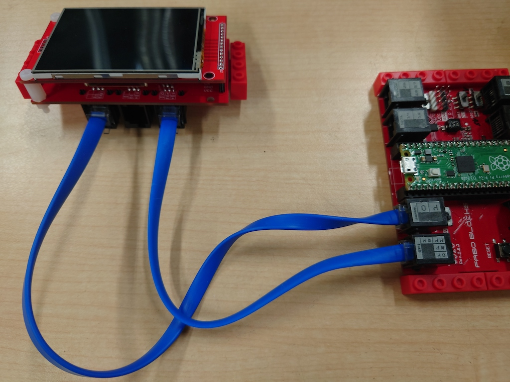

# 350 2.8inch Color LCD

2.8インチフルカラー液晶パネル採用（ILI9341)

240* 320ドット

タッチパネル付き


##Arduino

LCD SPI端子とFaBoBlocks SPI端子、DC,RS REST端子は、FaBo FaBoBlocks０、１ポートに接続します。





電源スライドスイッチ(SPI,UART,I2C)は５Vに合わせます。

Adafruitのライブラリをダウンロードします。

Arduino IDE

Sketch->Include Library->Manage Libraries...

ILI9341で検索して

Adafruit_ILI9341をインストールします。

Arduino IDE

File -> Examples -> Adafruit ILI9341-> graphicstest

以下のように変更します。

```cpp
/***************************************************
  This is our GFX example for the Adafruit ILI9341 Breakout and Shield
  ----> http://www.adafruit.com/products/1651

  Check out the links above for our tutorials and wiring diagrams
  These displays use SPI to communicate, 4 or 5 pins are required to
  interface (RST is optional)
  Adafruit invests time and resources providing this open source code,
  please support Adafruit and open-source hardware by purchasing
  products from Adafruit!

  Written by Limor Fried/Ladyada for Adafruit Industries.
  MIT license, all text above must be included in any redistribution
 ****************************************************/


#include "SPI.h"
#include "Adafruit_GFX.h"
#include "Adafruit_ILI9341.h"

#define TFT_DC    0
#define TFT_RST   1
#define TFT_CS    13  
#define TFT_MOSI  11
#define TFT_CLK   10
#define TFT_MISO  12
Adafruit_ILI9341 tft = Adafruit_ILI9341(TFT_CS, TFT_DC, TFT_MOSI, TFT_CLK, TFT_RST, TFT_MISO);

```
