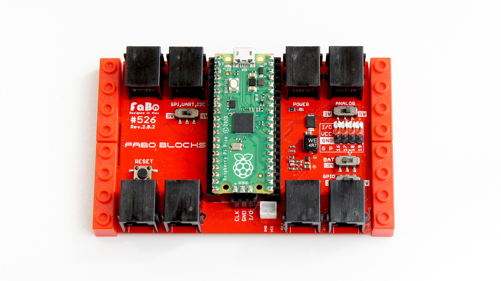

# FaBo Blocks Docs For Raspberry pi pico

##FaBo Blocks

&emsp;RJ11ケーブルでセンサーを用いましてRaspberryPico,RaspberryPico Wと簡単接続します。ブレッドボードや半田接続を必要とせず。ブロックで固定でき授業や研修がとてもスムーズになります。

2023年発売予定

## FaBo Blocks Docsについて

FaBo Blocksの学習用ドキュメントです。

## FaBo Blocksモジュール一覧表

準備中です。

## サポート Discord

準備中です。

## 修正依頼等

GithubのRepoに[Issues](https://github.com/FaBoPlatform/Block/issues)を投稿お願いいたします。

## 購入先(FaBo Store)

FaBo Blocks センサーセット　２０２３年発売予定

- [FaBo Store](https://www.fabo.store)

## 本ドキュメントでのセミナーの実施

検討中でございます。

## 関連記事

FaBoでは以下のAIに関する教材を販売しております。

## FaBo AI 教材
- [JetRacer Docs](https://faboplatform.github.io/JetracerDocs/)
- [JetBot Docs](https://faboplatform.github.io/JetbotDocs/)
- [DonkeyCar Docs](https://faboplatform.github.io/DonkeyDocs/)
- [EdgeAI Docs](https://faboplatform.github.io/EdgeAIDocs/)
- [JetBook Docs](https://faboplatform.github.io/JetBook/)
- [NSynth Docs](https://faboplatform.github.io/NSynthDocs/)

## FaBo教材
- [Arduino Docs](https://faboplatform.github.io/ArduinoDocs/)
- [RaspberryPi Docs](https://faboplatform.github.io/RaspberryPIDocs/)
- [IchigoJam Docs](https://faboplatform.github.io/IchigojamDocs/)
- [Circuit Docs](https://faboplatform.github.io/CircuitDocs/)
- [Denbun Docs](https://faboplatform.github.io/DenbunDocs/)
- [NRF Docs](https://faboplatform.github.io/NRFDocs/)
- [Android Things Docs](https://faboplatform.github.io/AndroidThingsDocs/)
- [DeviceWebAPI Docs](https://faboplatform.github.io/DeviceWebAPIDocs/)
